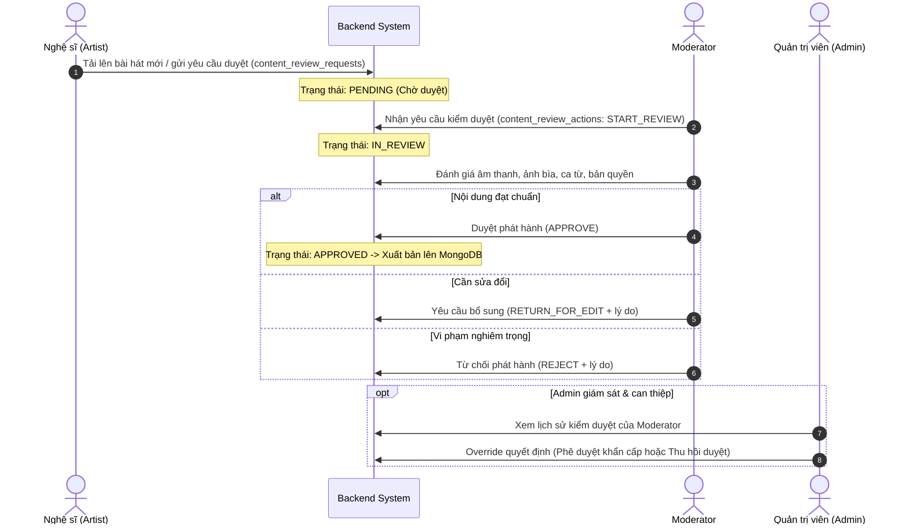

# Moodify Admin System - Báo Cáo Khảo Sát & Đặc Tả Nghiệp Vụ Quản Trị Hệ Thống

> **Dự án**: Moodify - Nền tảng phát nhạc trực tuyến cá nhân hóa theo cảm xúc (Emotion-Driven Music Streaming Platform)  
> **Cấp độ**: Đồ án tốt nghiệp (DATN)  
> **Tài liệu**: Khảo sát toàn diện hệ thống & Đặc tả chi tiết nghiệp vụ Quản trị viên (Admin Business Specification)  
> **Phiên bản**: 1.0.0  
> **Ngày lập**: 17/09/2026  

---

## MỤC LỤC

1. [TỔNG QUAN HỆ THỐNG & KIẾN TRÚC DỮ LIỆU](#1-tổng-quan-hệ-thống--kiến-trúc-dữ-liệu)
   - 1.1. Mục tiêu và sứ mệnh của Moodify
   - 1.2. Kiến trúc dữ liệu kép (Polyglot Persistence: MySQL + MongoDB)
   - 1.3. Mô hình phân quyền đa cấp (RBAC Matrix)
2. [KHẢO SÁT HIỆN TRẠNG CƠ SỞ DỮ LIỆU VÀ CÁC THỰC THỂ ADMIN](#2-khảo-sát-hiện-trạng-cơ-sở-dữ-liệu-và-các-thực-thể-admin)
   - 2.1. Lược đồ cơ sở dữ liệu quan hệ (MySQL RDBMS - 18 bảng)
   - 2.2. Lược đồ cơ sở dữ liệu phi quan hệ (MongoDB Document - 3 collections)
   - 2.3. Sơ đồ quan hệ thực thể tổng thể (ERD)
3. [ĐẶC TẢ CHI TIẾT 7 KHỐI NGHIỆP VỤ CHÍNH PHÍA ADMIN](#3-đặc-tả-chi-tiết-7-khối-nghiệp-vụ-chính-phía-admin)
   - 3.1. Nghiệp vụ 1: Quản lý Người dùng & Phân quyền (User & Identity Access Management)
   - 3.2. Nghiệp vụ 2: Quản lý Kho Âm nhạc & Siêu dữ liệu Cảm xúc (Music Catalog & Audio Features)
   - 3.3. Nghiệp vụ 3: Giám sát & Quản trị Quy trình Kiểm duyệt Nội dung (Content Moderation Oversight)
   - 3.4. Nghiệp vụ 4: Quản lý Bản quyền & Đối tác Phân phối (Licensing & Distribution Management)
   - 3.5. Nghiệp vụ 5: Quản lý Gói dịch vụ & Doanh thu Tài chính (Monetization & Billing)
   - 3.6. Nghiệp vụ 6: Báo cáo Thống kê & Phân tích Kinh doanh (Analytics & Business Intelligence)
   - 3.7. Nghiệp vụ 7: Quản trị Giao diện & Cấu hình Hệ thống (System Configuration & CMS)
4. [ĐẶC TẢ GIAO DIỆN & TRẢI NGHIỆM NGƯỜI DÙNG ADMIN (UI/UX DESIGN)](#4-đặc-tả-giao-diện--trải-nghiệm-người-dùng-admin-uiux-design)
5. [ĐẶC TẢ GIAO TIẾP API & HỢP ĐỒNG DỮ LIỆU (BACKEND-FRONTEND CONTRACT)](#5-đặc-tả-giao-tiếp-api--hợp-đồng-dữ-liệu-backend-frontend-contract)
6. [KẾ HOẠCH TRIỂN KHAI & DANH MỤC CÔNG VIỆC (ROADMAP)](#6-kế-hoạch-triển-khai--danh-mục-công-việc-roadmap)

---

## 1. TỔNG QUAN HỆ THỐNG & KIẾN TRÚC DỮ LIỆU

### 1.1. Mục tiêu và sứ mệnh của Moodify
Moodify là nền tảng streaming âm nhạc thế hệ mới hướng tới trải nghiệm cá nhân hóa đỉnh cao. Khác biệt cốt lõi của Moodify so với các dịch vụ truyền thống là **khả năng phân tích và gợi ý bài hát dựa trên tâm trạng/cảm xúc người nghe** (Emotion-driven streaming) kết hợp các chỉ số âm học chuyên sâu (**Audio Features: BPM, Energy, Valence, Danceability, Acousticness**).

### 1.2. Kiến trúc dữ liệu kép (Polyglot Persistence)
Hệ thống sử dụng đồng thời hai cơ sở dữ liệu chuyên biệt:

```
┌─────────────────────────────────────────────────────────────────────────────────┐
│                               MOODIFY FULLSTACK                                 │
│                                                                                 │
│   Frontend: Next.js 16 (React 19, TypeScript, Tailwind CSS v4, i18next)        │
│   Backend: Spring Boot 4.1.0 (Java 21, Spring Security Stateless JWT)           │
└───────────────────────┬─────────────────────────────────┬───────────────────────┘
                        │                                 │
                        ▼                                 ▼
         ┌──────────────────────────────┐ ┌──────────────────────────────┐
         │         MySQL 8.0            │ │       MongoDB Database       │
         │         (Relational)         │ │       (Document-based)       │
         ├──────────────────────────────┤ ├──────────────────────────────┤
         │ • users (Auth, Role, Status) │ │ • tracks (Audio metadata,    │
         │ • user_devices (Offline DRM) │ │   AudioFeatures, lyrics)     │
         │ • subscriptions & payments   │ │ • artists (Profiles, genres, │
         │ • service_packages           │ │   popularity, followers)     │
         │ • content_review_requests    │ │ • albums (Track IDs, cover)  │
         │ • content_review_actions     │ └──────────────┬───────────────┘
         │ • distributors & contracts   │                │
         │ • song_licenses              │                │
         │ • listening & search history │                │
         └──────────────┬───────────────┘                │
                        │                                │
                        └──────── users.artist_spotify_id ┘
                                   <===> artists.spotify_id
```

* **MySQL (ACID, Giao dịch, Quan hệ)**: Lưu trữ các dữ liệu mang tính cấu trúc cao, yêu cầu tính toàn vẹn tuyệt đối: người dùng, phiên thiết bị, quyền hạn, thanh toán, hợp đồng phân phối bản quyền, lịch sử nghe và quy trình kiểm duyệt.
* **MongoDB (NoSQL Document, Khối lượng lớn, Linh hoạt)**: Lưu trữ kho dữ liệu bài hát, album, nghệ sĩ với siêu dữ liệu âm học (Audio Features) phong phú từ Spotify dataset và file upload của nghệ sĩ.
* **Cầu nối dữ liệu (Data Bridge)**: Cột `users.artist_spotify_id` trong MySQL liên kết trực tiếp với `artists.spotify_id` trong MongoDB.

### 1.3. Mô hình phân quyền đa cấp (RBAC Matrix)

| Chức năng / Quyền hạn | USER (Thính giả) | ARTIST (Nghệ sĩ) | MODERATOR (Kiểm duyệt) | ADMIN (Quản trị viên) |
| :--- | :---: | :---: | :---: | :---: |
| Nghe nhạc, tìm kiếm theo cảm xúc, tạo thư viện | ✅ | ✅ | ✅ | ✅ |
| Upload bài hát, quản lý catalog âm nhạc cá nhân | ❌ | ✅ | ❌ | ✅ (Toàn quyền can thiệp) |
| Kiểm duyệt bài hát/album, duyệt nội dung | ❌ | ❌ | ✅ | ✅ (Cấp quyền & Override) |
| Khóa/Mở khóa tài khoản người dùng, đổi Role | ❌ | ❌ | ❌ | ✅ (Độc quyền) |
| Quản lý nhà phân phối, hợp đồng, bản quyền | ❌ | ❌ | Xem giới hạn | ✅ (Độc quyền) |
| Cấu hình gói cước, giá tiền, xem doanh thu | ❌ | ❌ | ❌ | ✅ (Độc quyền) |
| Xem Dashboard phân tích hệ thống (Analytics BI) | ❌ | Phân tích cá nhân | Phân tích duyệt | ✅ (Báo cáo tổng quan hệ thống) |
| Cấu hình tham số hệ thống & CMS Banner | ❌ | ❌ | ❌ | ✅ (Độc quyền) |

---

## 2. KHẢO SÁT HIỆN TRẠNG CƠ SỞ DỮ LIỆU VÀ CÁC THỰC THỂ ADMIN

### 2.1. Lược đồ cơ sở dữ liệu quan hệ (MySQL RDBMS)

Hệ thống MySQL gồm **18 bảng nghiệp vụ chuẩn hóa**, trong đó các bảng tác động trực tiếp đến Admin gồm:

1. **`users`**:
   - `id`: Khóa chính.
   - `full_name`, `username`, `email`, `phone`: Thông tin cá nhân định danh.
   - `role`: Enum (`'USER'`, `'ARTIST'`, `'MODERATOR'`, `'ADMIN'`).
   - `status`: Enum (`'ACTIVE'`, `'INACTIVE'`, `'BANNED'`).
   - `artist_spotify_id`: Khóa ngoại logic liên kết sang MongoDB.
   - `last_login_at`, `created_at`, `updated_at`.
2. **`user_devices`**: Quản lý thiết bị nghe nhạc ngoại tuyến (Mobile Android/iOS/Other) với trạng thái `ACTIVE | REVOKED`.
3. **`service_packages`**:
   - `id`, `name`, `description`, `price`, `duration_days`, `display_order`, `status` (`ACTIVE | INACTIVE`).
   - Admin quản lý giá bán, thời hạn gói dịch vụ (Trial, Premium 30 ngày, 90 ngày, Artist Pro 365 ngày).
4. **`subscriptions`**:
   - Quản lý gói cước đăng ký của từng user (`PENDING | ACTIVE | EXPIRED | CANCELLED | SUSPENDED`), tự động gia hạn (`auto_renew`).
5. **`payment_transactions`**:
   - Giao dịch thanh toán: `amount`, `payment_method`, `provider` (VNPAY, MOMO), `provider_transaction_id`, `status` (`PENDING | SUCCESS | FAILED | CANCELLED | REFUNDED`), `paid_at`.
6. **`content_review_requests`**:
   - Hàng đợi yêu cầu kiểm duyệt: `artist_user_id`, `content_type` (`TRACK | ALBUM`), `content_id` (ref MongoDB), `request_type` (`PUBLISH | UPDATE`), `status` (`PENDING | IN_REVIEW | APPROVED | REJECTED | CANCELLED`).
7. **`content_review_actions`**:
   - Nhật ký hành động kiểm duyệt: `review_request_id`, `moderator_user_id`, `action` (`START_REVIEW | APPROVE | REJECT | RETURN_FOR_EDIT`), `reason`, `created_at`.
8. **`distributors`**:
   - Nhà phân phối: `company_name`, `country`, `contact_name`, `contact_email`, `contact_phone`, `status` (`ACTIVE | INACTIVE`).
9. **`distribution_contracts`**:
   - Hợp đồng: `distributor_id`, `contract_code`, `title`, `signed_date`, `effective_from`, `effective_to`, `revenue_share` (% tỷ lệ chia sẻ doanh thu), `document_url`, `status` (`DRAFT | ACTIVE | EXPIRED | TERMINATED`).
10. **`song_licenses`**:
    - Giấy phép bản quyền bài hát: `track_id` (ref MongoDB), `distributor_id`, `distribution_contract_id`, `license_type`, `copyright_owner`, `issue_date`, `expiry_date`, `status` (`ACTIVE | EXPIRED | REVOKED | PENDING`), `document_songlicenses_url`.
11. **`listening_history` & `playback_events`**:
    - Ghi nhận chi tiết mỗi lượt nghe (thời lượng nghe thực tế `listened_duration_ms`, nguồn nghe `HOME | SEARCH | EMOTION | PLAYLIST | ...`, thiết bị `WEB | ANDROID | IOS`).
12. **`search_history`**:
    - Lịch sử tìm kiếm: `keyword`, `search_type`, `detected_emotion` (cảm xúc phát hiện), `emotion_confidence` (độ tin cậy AI), `selected_target_type`, `selected_target_id`.

### 2.2. Lược đồ cơ sở dữ liệu phi quan hệ (MongoDB Document)

1. **`tracks`**:
   - `id`, `spotify_id`, `name`, `artist_name`, `artist_spotify_id`, `album_name`, `album_spotify_id`, `image_url`, `release_date`, `duration_ms`, `duration_formatted`.
   - `genres`, `genres_raw`, `popularity`, `lyrics_plain`, `local_path`, `download_status`, `spotify_url`.
   - `moderation_status`, `moderation_score`.
   - **`audio_features`**: `bpm`, `key_signature`, `energy`, `danceability`, `valence`, `acousticness`.
2. **`artists`**:
   - `id`, `spotify_id`, `name`, `image_url`, `followers`, `popularity`, `genres`, `genres_raw`.
3. **`albums`**:
   - `id`, `spotify_id`, `name`, `artist_name`, `artist_spotify_id`, `image_url`, `release_date`, `total_tracks`, `track_ids`.

---

## 3. ĐẶC TẢ CHI TIẾT 7 KHỐI NGHIỆP VỤ CHÍNH PHÍA ADMIN

```
┌─────────────────────────────────────────────────────────────────────────────┐
│                          MOODIFY ADMIN DASHBOARD                            │
├─────────────────────────────────────────────────────────────────────────────┤
│ 1. IAM & User Control      │ Quản lý Users, phân vai trò, khóa/mở tài khoản │
│ 2. Music Catalog & AI Mood │ Quản lý bài hát, Audio Features, gán cảm xúc   │
│ 3. Moderation Oversight    │ Giám sát luồng duyệt bài hát, audit Moderators │
│ 4. Licensing & Distribution│ Nhà phân phối, hợp đồng tác quyền, bản quyền   │
│ 5. Monetization & Billing  │ Cấu hình gói dịch vụ, quản lý giao dịch VNPAY  │
│ 6. Analytics & BI Reports  │ Chỉ số DAU/MAU, lượt phát nhạc, phân bổ Mood   │
│ 7. System CMS & Settings   │ Quản lý Banner Carousel, cấu hình AI tham số   │
└─────────────────────────────────────────────────────────────────────────────┘
```

---

### 3.1. Nghiệp vụ 1: Quản lý Người dùng & Phân quyền (IAM - Identity & Access Management)

#### Mục tiêu:
Đảm bảo an toàn tài khoản, phân quyền chính xác theo trách nhiệm và kiểm soát các hành vi gian lận hoặc vi phạm tiêu chuẩn cộng đồng.

#### Các chức năng cụ thể:
1. **Tra cứu & Quản lý danh sách người dùng (User Management)**:
   - Danh sách hiển thị dạng bảng có phân trang (`page`, `size`), tìm kiếm đa tiêu chí (`username`, `email`, `full_name`, `phone`).
   - Bộ lọc trạng thái: `Tất cả`, `Đang hoạt động (ACTIVE)`, `Chưa kích hoạt (INACTIVE)`, `Đã bị khóa (BANNED)`.
   - Bộ lọc vai trò: `USER`, `ARTIST`, `MODERATOR`, `ADMIN`.
2. **Khóa & Mở khóa tài khoản (Ban/Unban Action)**:
   - Khi chọn "Khóa tài khoản", Admin bắt buộc nhập:
     - *Lý do vi phạm* (vi phạm bản quyền, spam bình luận, gian lận thanh toán, hành vi độc hại).
     - *Thời hạn khóa* (7 ngày, 30 ngày, hoặc Vĩnh viễn).
   - Hệ thống lập tức thu hồi toàn bộ token đăng nhập (`revoke refresh tokens`) và chuyển trạng thái user sang `BANNED`.
   - Khi user bị khóa cố gắng đăng nhập, hệ thống hiển thị thông báo lỗi rõ ràng kèm lý do và liên hệ hỗ trợ.
3. **Thăng cấp vai trò & Bổ nhiệm nhân sự (Role Promotion)**:
   - Thăng cấp một tài khoản thông thường lên **Kiểm duyệt viên (MODERATOR)**: gán mã nhân viên `staffCode` để phục vụ truy vết audit.
   - Thăng cấp tài khoản lên **ADMIN**: Yêu cầu xác thực mật khẩu cấp 2 của Super Admin hiện tại.
4. **Xác thực hồ sơ Nghệ sĩ (Artist Verification & Linkage)**:
   - Phê duyệt đơn đăng ký chuyển đổi tài khoản thành Nghệ sĩ chính thức.
   - Tự động hoặc thủ công liên kết `artist_spotify_id` để kết nối MySQL User với Document Artist trên MongoDB.
   - Cấp tích xanh xác thực (Verified Artist Badge) hiển thị trên giao diện nghe nhạc.
5. **Giám sát thiết bị ngoại tuyến (`user_devices`)**:
   - Theo dõi danh sách thiết bị di động (Android/iOS) đã liên kết tính năng nghe offline.
   - Quyền cưỡng chế thu hồi thiết bị (`REVOKED`) nếu phát hiện chia sẻ tài khoản bất hợp pháp (vượt quá giới hạn thiết bị cho phép của gói Premium).

---

### 3.2. Nghiệp vụ 2: Quản lý Kho Âm nhạc & Siêu dữ liệu Cảm xúc (Music Catalog & AI Mood)

#### Mục tiêu:
Quản lý tập trung toàn bộ kho tài nguyên âm nhạc từ MongoDB, đảm bảo chất lượng âm thanh, độ chính xác của metadata và tính tương thích với mô hình AI gợi ý cảm xúc.

#### Các chức năng cụ thể:
1. **Quản lý danh mục bài hát (Tracks Catalog)**:
   - Tra cứu bài hát theo tên, nghệ sĩ, album, thể loại hoặc mã định danh `spotify_id`.
   - Xem chi tiết chỉ số âm học chuyên sâu (**Audio Features**):
     - `BPM` (Nhịp đập mỗi phút - Tempos).
     - `Energy` (Mức độ sôi động: 0.0 - 1.0).
     - `Danceability` (Độ bắt tai khi nhảy: 0.0 - 1.0).
     - `Valence` (Sắc thái tích cực/vui tươi của âm thanh: 0.0 - 1.0).
     - `Acousticness` (Độ mộc của nhạc cụ: 0.0 - 1.0).
     - `Key Signature` (Giọng và cung bài hát: C, D, Em, G,...).
2. **Gắn nhãn và Phân loại Cảm xúc (Emotion & Vibe Mapping)**:
   - Hệ thống phân nhóm các bài hát vào các Vibe chủ đạo của Moodify:
     - `Energetic / Hưng phấn` (High Energy, High BPM).
     - `Chill / Thư thái` (Mid Tempo, High Acousticness).
     - `Sad / Tâm trạng` (Low Valence, Low Energy).
     - `Focus / Tập trung` (Instrumental, Ambient, Low Vocal).
     - `Romance / Lãng mạn` (High Valence, Warm Acoustic).
   - Admin có quyền điều chỉnh bằng tay nhãn cảm xúc của bài hát nếu thuật toán tự động nhận diện chưa tối ưu.
3. **Quản lý Nghệ sĩ & Album (Artists & Albums Management)**:
   - Chỉnh sửa thông tin công khai của nghệ sĩ: Tên nghệ danh, ảnh đại diện, danh sách thể loại nhạc (`genres`), liên kết mạng xã hội.
   - Quản lý danh sách album, thứ tự bài hát trong album.
4. **Cưỡng chế gỡ bỏ nội dung (Content Takedown / Copyright Violation)**:
   - Khóa phát sóng hoặc gỡ hoàn toàn bài hát (`moderation_status = 'REJECTED' / 'TAKEN_DOWN'`) khi có yêu cầu vi phạm pháp luật hoặc tranh chấp quyền sở hữu trí tuệ.
   - Tự động xóa bài hát khỏi tất cả playlist công cộng và hàng đợi nghe của người dùng.

---

### 3.3. Nghiệp vụ 3: Giám sát & Quản trị Quy trình Kiểm duyệt Nội dung (Content Moderation Oversight)

#### Mục tiêu:
Đảm bảo tất cả nội dung do Nghệ sĩ tải lên đều đáp ứng quy chuẩn văn hóa, bản quyền và chất lượng âm thanh trước khi đến tai thính giả.

#### Luồng nghiệp vụ kiểm duyệt:



#### Các chức năng cụ thể:
1. **Hàng đợi kiểm duyệt trung tâm (Review Queue)**:
   - Danh sách các yêu cầu kiểm duyệt `content_review_requests` phân loại theo:
     - Loại nội dung: `TRACK` (Bài hát) hoặc `ALBUM` (Album trọn bộ).
     - Loại yêu cầu: `PUBLISH` (Phát hành mới) hoặc `UPDATE` (Cập nhật bản phối/thông tin).
     - Mức độ ưu tiên: Dựa trên ngày gửi và độ uy tín của Artist.
2. **Quyền Can thiệp cấp cao (Admin Override)**:
   - Admin có quyền trực tiếp phê duyệt hoặc bác bỏ bất kỳ yêu cầu nào mà không cần qua Moderator.
   - Xem chi tiết lịch sử thao tác của Moderator (`content_review_actions`): Ai đã duyệt? Vào thời điểm nào? Ghi chú lý do là gì?
3. **Kiểm duyệt Bình luận & Báo cáo người dùng (Report & Comment Moderation)**:
   - Theo dõi các bình luận bị người nghe bấm "Report" (Báo cáo nội dung xúc phạm, quấy rối, từ ngữ không phù hợp).
   - Xóa bình luận độc hại, tạm khóa quyền bình luận của người vi phạm.

---

### 3.4. Nghiệp vụ 4: Quản lý Bản quyền & Đối tác Phân phối (Licensing & Distribution Management)

#### Mục tiêu:
Quản lý tính pháp lý của âm nhạc được phát hành trên Moodify, bảo đảm tuân thủ Luật Sở hữu Trí tuệ và các thỏa thuận phân chia doanh thu với hãng đĩa/nhà phân phối.

#### Các chức năng cụ thể:
1. **Quản lý danh bạ Nhà phân phối (`distributors`)**:
   - Quản lý hồ sơ đối tác: Universal Music Vietnam, Believe Digital, Sony Music, Warner Music hoặc các hãng đĩa Indie.
   - Thông tin liên hệ, người đại diện, trạng thái hợp tác (`ACTIVE | INACTIVE`).
2. **Quản lý Hợp đồng phân phối (`distribution_contracts`)**:
   - Quản lý mã hợp đồng, tiêu đề, ngày ký kết, ngày hiệu lực và ngày đáo hạn.
   - Cấu hình **Tỷ lệ chia sẻ doanh thu (`revenue_share` %)**: Tỷ lệ phần trăm doanh thu từ lượt stream hoặc gói dịch vụ được chia lại cho đối tác.
   - Đính kèm liên kết file văn bản hợp đồng số hóa (`document_url` PDF).
   - Cảnh báo các hợp đồng sắp hết hạn (30 ngày trước ngày hết hiệu lực).
3. **Quản lý Giấy phép bài hát (`song_licenses`)**:
   - Tra cứu giấy phép theo `track_id`.
   - Phân loại hình thức giấy phép:
     - `DIGITAL_STREAMING`: Quyền phát trực tuyến kỹ thuật số.
     - `MASTER_LICENSE`: Quyền sử dụng bản ghi âm gốc.
     - `DIRECT_LICENSE`: Giấy phép ủy quyền trực tiếp từ nghệ sĩ độc lập.
   - Quản lý thời hạn bản quyền, chủ sở hữu tác quyền (`copyright_owner`), và chứng thư tác quyền số (`document_songlicenses_url`).
   - Cơ chế tự động khóa phát bài hát khi giấy phép hết hạn (`status = 'EXPIRED'`).

---

### 3.5. Nghiệp vụ 5: Quản lý Gói dịch vụ & Doanh thu Tài chính (Monetization & Billing)

#### Mục tiêu:
Quản trị mô hình kinh doanh đăng ký định kỳ (Subscription Business Model), quản lý các gói cước và đối soát doanh thu từ các cổng thanh toán.

#### Các chức năng cụ thể:
1. **Cấu hình Danh mục Gói dịch vụ (`service_packages`)**:
   - Tạo mới / Chỉnh sửa / Bật-Tắt các gói dịch vụ hiển thị trên hệ thống:
     - Gói dùng thử: `Moodify Trial 7 Days` (Giá: 0 VNĐ).
     - Gói tháng cá nhân: `Premium 30 Days` (Giá: 59.000 VNĐ).
     - Gói quý: `Premium 90 Days` (Giá: 149.000 VNĐ).
     - Gói năm cho Nghệ sĩ: `Artist Pro 365 Days` (Giá: 599.000 VNĐ).
   - Thiết lập các trường: Tên gói, mô tả quyền lợi, giá tiền (`price >= 0`), thời hạn tính theo ngày (`duration_days > 0`), thứ tự ưu tiên hiển thị (`display_order`), trạng thái (`ACTIVE | INACTIVE`).
2. **Quản lý Thuê bao Người dùng (`subscriptions`)**:
   - Theo dõi trạng thái gói cước của toàn bộ thính giả:
     - `PENDING`: Đang chờ thanh toán xác nhận.
     - `ACTIVE`: Đang có hiệu lực sử dụng các tính năng Premium (nghe nhạc chất lượng cao lossless, tải offline, không quảng cáo).
     - `EXPIRED`: Đã quá hạn thuê bao.
     - `CANCELLED`: Người dùng chủ động hủy gia hạn.
     - `SUSPENDED`: Admin tạm đình chỉ gói thuê bao do phát hiện nghi vấn gian lận thẻ.
   - Khả năng can thiệp thủ công: Gia hạn thêm ngày dùng cho tài khoản được đền bù dịch vụ.
3. **Đối soát & Báo cáo Giao dịch Thanh toán (`payment_transactions`)**:
   - Tra cứu lịch sử thanh toán toàn diện: Mã giao dịch hệ thống, mã giao dịch đối tác (`provider_transaction_id`), số tiền, cổng thanh toán (`VNPAY`, `MOMO`, Thẻ quốc tế), thời gian thanh toán.
   - Xử lý hoàn tiền (Refund Workflow): Chuyển trạng thái giao dịch sang `REFUNDED` và cập nhật hủy quyền Premium tương ứng của người dùng.

---

### 3.6. Nghiệp vụ 6: Báo cáo Thống kê & Phân tích Kinh doanh (Analytics & Business Intelligence)

#### Mục tiêu:
Cung cấp cái nhìn toàn cảnh về sức khỏe nền tảng, hành vi nghe nhạc, xu hướng cảm xúc và các chỉ số kinh doanh phục vụ ra quyết định chiến lược.

#### Các khối chỉ số thống kê (Executive KPI Cards):
1. **Chỉ số Người dùng (Audience Metrics)**:
   - Tổng số tài khoản đăng ký.
   - Người dùng hoạt động hàng ngày (DAU) & Người dùng hoạt động hàng tháng (MAU).
   - Tỷ lệ chuyển đổi từ người nghe miễn phí (Free User) sang thuê bao trả phí (Premium Subscribers).
2. **Chỉ số Phát nhạc (Streaming Metrics)**:
   - Tổng số lượt nghe trong ngày / tuần / tháng (dựa trên `listening_history`).
   - Tổng thời lượng nghe (giờ nghe tích lũy).
   - Tỷ lệ hoàn thành bài hát (Completion Rate) vs Tỷ lệ chuyển bài sớm (Skip Rate dựa trên `playback_events`).
   - Phân bổ thiết bị nghe nhạc: Web Player, Ứng dụng Android, Ứng dụng iOS.
3. **Chỉ số Trí tuệ Cảm xúc (Emotion Intelligence Analytics - Độc quyền Moodify)**:
   - Biểu đồ phân bổ cảm xúc người dùng tìm kiếm (`search_history.detected_emotion`): Ví dụ Sadness 35%, Joy 28%, Chill 22%, Angry 15%.
   - Biểu đồ nhiệt (Heatmap) cảm xúc theo khung giờ: Thống kê người dùng thường nghe nhạc gì vào buổi sáng (Energetic), buổi chiều học tập (Focus) và đêm muộn (Chill / Sadness).
   - Tỷ lệ chính xác của mô hình nhận diện cảm xúc dựa trên độ tin cậy `emotion_confidence`.
4. **Bảng xếp hạng Nền tảng (Platform Top Charts)**:
   - Top 10 bài hát có lượt stream cao nhất.
   - Top 10 nghệ sĩ thịnh hành nhất (Trending Artists).
   - Top album được yêu thích nhiều nhất (`favorite_albums`).
5. **Chỉ số Doanh thu (Revenue Metrics)**:
   - Doanh thu theo tháng / quý / năm.
   - Doanh thu phân bổ theo từng gói dịch vụ.
   - Tỷ lệ gia hạn thành công (Renewal Rate).

---

### 3.7. Nghiệp vụ 7: Quản trị Giao diện & Cấu hình Hệ thống (System Configuration & CMS)

#### Mục tiêu:
Kiểm soát nội dung hiển thị trên trang chủ và tinh chỉnh các tham số vận hành mà không cần sửa code hay triển khai lại backend.

#### Các chức năng cụ thể:
1. **Quản trị Hero Carousel & Banner Trang chủ (`/dashboard`)**:
   - Quản lý các slide hình ảnh/video quảng bá bài hát hot, nghệ sĩ của tháng, sự kiện âm nhạc.
   - Cài đặt tiêu đề, phụ đề, nút kêu gọi hành động (Call To Action - CTA Link), thời gian chạy chiến dịch.
2. **Cấu hình tham số Hệ thống (System Parameters)**:
   - Cấu hình ngưỡng độ tin cậy của AI Cảm xúc: Chỉ hiển thị gợi ý khi `confidence >= 0.75`.
   - Giới hạn số thiết bị đăng ký offline cho một tài khoản Premium (mặc định: tối đa 3 thiết bị).
   - Cài đặt thời gian hết hạn của Access Token và Refresh Token.
3. **Nhật ký Kiểm toán Hệ thống (Audit Trail / Security Log)**:
   - Ghi nhận chi tiết mọi thao tác có tính ảnh hưởng cao của Admin và Moderator:
     - `[ADMIN: admin01] Đã khóa tài khoản [username: spammer99] - Lý do: Spam bình luận độc hại.`
     - `[ADMIN: admin01] Đã điều chỉnh giá gói Premium 30 Days từ 59.000 VNĐ -> 49.000 VNĐ.`
     - `[MODERATOR: moderator01] Đã phê duyệt bài hát [ID: 6a823...d10] của nghệ sĩ [artist01].`

---

## 4. ĐẶC TẢ GIAO DIỆN & TRẢI NGHIỆM NGƯỜI DÙNG ADMIN (UI/UX DESIGN)

### 4.1. Phong cách thiết kế (Design System)
Tuân thủ tuyệt đối ngôn ngữ thiết kế chung của Moodify:
* **Chủ đề (Theme)**: Dark Theme cao cấp (`#0a0b0e`, `#121316`, `#1a1c23`).
* **Bảng màu chủ đạo (Color Palette)**:
  * Cam hoàng hôn rực rỡ (Primary Accent): `#ff7a2c` -> `#ff9b57`.
  * Xanh tím neon (Secondary Accent): `#8fb4ff` -> `#5d7cfa`.
  * Trạng thái thành công: `#22c55e` (Emerald Green).
  * Trạng thái cảnh báo: `#eab308` (Amber Yellow).
  * Trạng thái từ chối / Khóa: `#ef4444` (Rose Red).
* **Hiệu ứng thị giác (Visual Polish)**: Glassmorphism (viền `border-white/8`, nền mờ `backdrop-blur-md`), thẻ nổi bật với bóng đổ sâu (`shadow-[0_20px_50px_rgba(0,0,0,0.4)]`), chuyển động mượt mà (Micro-animations).

### 4.2. Kiến trúc Bố cục Giao diện (Layout Architecture)

```
┌────────────────────────────────────────────────────────────────────────────────────────┐
│ TOPBAR: [Moodify Logo]  [Search Box]  [Language Switcher]  [Admin Avatar & Quick Menu] │
├──────────────────┬─────────────────────────────────────────────────────────────────────┤
│ SIDEBAR MENU     │ MAIN CONTENT VIEW                                                   │
│                  │                                                                     │
│ • Tổng quan (BI) │ ┌──────────┐ ┌──────────┐ ┌──────────┐ ┌──────────┐                 │
│ • Người dùng     │ │ Users    │ │ Streams  │ │ Revenue  │ │ Pending  │                 │
│ • Kho âm nhạc    │ │ 12,450   │ │ 340.2K   │ │ 48.5M đ  │ │ 18 tracks│                 │
│ • Kiểm duyệt     │ └──────────┘ └──────────┘ └──────────┘ └──────────┘                 │
│ • Bản quyền      │                                                                     │
│ • Gói cước       │ ┌───────────────────────────────────┐ ┌───────────────────────────┐ │
│ • Cấu hình CMS   │ │ Biểu đồ tăng trưởng nghe nhạc     │ │ Phân bổ cảm xúc (Mood AI) │ │
│ • Đăng xuất      │ │ [~~~~~~~~~~ Line Chart ~~~~~~~~~] │ │ [ (O) Donut Emotion Chart]│ │
│                  │ └───────────────────────────────────┘ └───────────────────────────┘ │
│                  │                                                                     │
│                  │ ┌─────────────────────────────────────────────────────────────────┐ │
│                  │ │ Bảng dữ liệu tác vụ nhanh (Quick Task Action Table)             │ │
│                  │ └─────────────────────────────────────────────────────────────────┘ │
└──────────────────┴─────────────────────────────────────────────────────────────────────┘
```

---

## 5. ĐẶC TẢ GIAO TIẾP API & HỢP ĐỒNG DỮ LIỆU (BACKEND-FRONTEND CONTRACT)

Dưới đây là danh mục các API Endpoint cần thiết cho toàn bộ phân hệ Admin Dashboard:

### 5.1. Nhóm Xác thực & Phân quyền Dashboard
* `GET /api/dashboard/admin`: Kiểm tra quyền truy cập Admin Dashboard (bảo vệ bởi `hasRole('ADMIN')`).
  * Response: `{ dashboard: "/dashboard/admin", role: "ADMIN", message: "...", user: {...} }`

### 5.2. Nhóm Quản lý Người dùng (Users IAM)
* `GET /api/admin/users`: Lấy danh sách người dùng phân trang (Query: `page`, `size`, `query`, `role`, `status`).
* `GET /api/admin/users/{id}`: Chi tiết hồ sơ người dùng kèm thống kê số thiết bị, gói cước, lịch sử nghe.
* `PUT /api/admin/users/{id}/status`: Cập nhật trạng thái (`ACTIVE`, `INACTIVE`, `BANNED`) kèm `reason`.
* `PUT /api/admin/users/{id}/role`: Cấp/đổi quyền (`USER`, `ARTIST`, `MODERATOR`, `ADMIN`).

### 5.3. Nhóm Quản lý Bài hát & Kho nhạc (Catalog)
* `GET /api/admin/tracks`: Lấy danh sách bài hát toàn sàn từ MongoDB (Query: `query`, `genre`, `status`).
* `PUT /api/admin/tracks/{id}/moderation`: Gỡ bài hát / Khóa bài hát khẩn cấp (`moderation_status`).
* `GET /api/admin/tracks/{id}/audio-features`: Xem chi tiết chỉ số BPM, Energy, Valence.

### 5.4. Nhóm Giám sát Kiểm duyệt (Moderation)
* `GET /api/admin/moderation/queue`: Lấy danh sách các yêu cầu đang chờ duyệt (`PENDING`, `IN_REVIEW`).
* `POST /api/admin/moderation/{requestId}/action`: Admin can thiệp duyệt/từ chối (`APPROVE`, `REJECT`, `RETURN_FOR_EDIT`).
* `GET /api/admin/moderation/audit`: Lịch sử hành động của các Moderator.

### 5.5. Nhóm Gói cước & Doanh thu (Monetization)
* `GET /api/admin/packages`: Lấy danh sách tất cả gói dịch vụ (`service_packages`).
* `POST /api/admin/packages`: Tạo gói cước mới.
* `PUT /api/admin/packages/{id}`: Chỉnh sửa thông tin/giá gói cước.
* `GET /api/admin/transactions`: Lịch sử giao dịch thanh toán VNPAY/MOMO có phân trang và lọc theo trạng thái.

### 5.6. Nhóm Báo cáo Thống kê (Analytics BI)
* `GET /api/admin/analytics/overview`: Lấy các chỉ số tổng quan (Tổng user, lượt stream hôm nay, doanh thu tháng, số bài chờ duyệt).
* `GET /api/admin/analytics/emotions`: Thống kê tần suất tìm kiếm theo cảm xúc (`search_history`).
* `GET /api/admin/analytics/top-charts`: Top bài hát, Top nghệ sĩ nghe nhiều nhất.

---

## 6. KẾ HOẠCH TRIỂN KHAI & DANH MỤC CÔNG VIỆC (ROADMAP)

### Giai đoạn 1: Khởi tạo Trang & Điều hướng (Frontend Foundation)
- [x] Khảo sát cơ sở dữ liệu và hiện trạng code Backend/Frontend.
- [x] Lập tài liệu đặc tả nghiệp vụ chi tiết (`ADMIN_BUSINESS_SPECIFICATION.md`).
- [ ] Tạo Route Frontend [app/dashboard/admin/page.tsx](file:///d:/Hai/study/DATN/Moodify/Moodify/app/dashboard/admin/page.tsx).
- [ ] Thiết lập Route Guard xác thực quyền `ADMIN` (tự động điều hướng về `/dashboard/user` nếu không phải Admin, hoặc `/dashboard` nếu chưa đăng nhập).
- [ ] Cập nhật logic đăng nhập tại [hero-carousel.tsx](file:///d:/Hai/study/DATN/Moodify/Moodify/features/home/components/hero-carousel.tsx) để tài khoản `admin01` đăng nhập sẽ tự động chuyển hướng vào `/dashboard/admin`.

### Giai đoạn 2: Xây dựng Giao diện Quản trị (Admin UI Components)
- [ ] Xây dựng khung giao diện Admin Dashboard (`features/dashboard/admin/components/admin-dashboard-page.tsx`):
  - Sidebar điều hướng đa tab (Tổng quan, Người dùng, Kho nhạc, Kiểm duyệt, Gói cước, Cài đặt).
  - Header với thông tin Quản trị viên và nút Đăng xuất an toàn.
- [ ] Xây dựng Tab **Tổng quan & Báo cáo (Overview BI Tab)**:
  - 4 thẻ KPI động (Người dùng, Lượt stream, Doanh thu, Hàng đợi duyệt).
  - Biểu đồ phân bổ cảm xúc Moodify độc quyền.
  - Bảng danh sách bài hát thịnh hành (Top Charts).
- [ ] Xây dựng Tab **Quản lý Người dùng (Users Management Tab)**:
  - Bảng danh sách tài khoản kèm bộ lọc Role và Status.
  - Modal xem chi tiết và Khóa/Mở khóa tài khoản (Ban/Unban Modal).
- [ ] Xây dựng Tab **Kiểm duyệt & Nội dung (Moderation & Catalog Tab)**:
  - Danh sách bài hát chờ duyệt từ nghệ sĩ.
  - Thao tác Phê duyệt (Approve) / Từ chối (Reject) trực tiếp.
- [ ] Xây dựng Tab **Gói cước & Doanh thu (Packages & Billing Tab)**:
  - Danh sách gói dịch vụ và lịch sử giao dịch.

### Giai đoạn 3: Tích hợp API Backend & Kiểm thử Toàn diện (Integration & Testing)
- [ ] Tạo `AdminApi.java` và `AdminService.java` trên Spring Boot để phục vụ các API phân trang và thao tác dữ liệu.
- [ ] Kết nối Frontend với live backend API chạy trên cổng `http://localhost:8088`.
- [ ] Kiểm thử kiểm tra bảo mật (Penetration check): Đảm bảo các tài khoản thường (`USER`) hoặc `ARTIST` không thể truy cập trái phép API và Dashboard của Admin.
- [ ] Kiểm thử đầy đủ trên trình duyệt: Giao diện responsive trên Desktop/Tablet, không xuất hiện cảnh báo console hay lỗi build.

---
*Tài liệu này là căn cứ kỹ thuật chính thức để phát triển và nghiệm thu phân hệ Quản trị viên (Admin) cho đồ án Moodify.*
