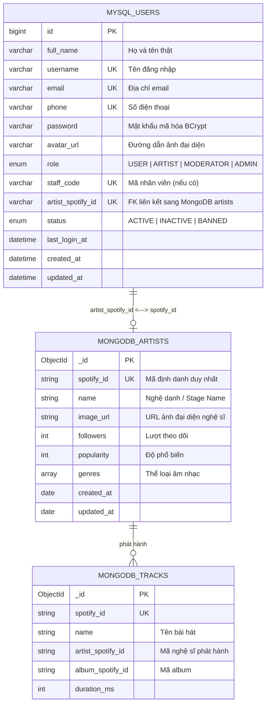

# Moodify Database Architecture & Schema Reference

> Tài liệu mô tả cấu trúc cơ sở dữ liệu Moodify sau phiên cập nhật tính năng: **Đăng ký tài khoản, Phân vai trò (User/Artist), Nghệ danh (Stage Name) và Lưu Avatar**.

---

## 1. Tổng quan Kiến trúc Dữ liệu Kép (Polyglot Persistence)

Hệ thống Moodify kết hợp hai hệ quản trị cơ sở dữ liệu để tối ưu hóa hiệu năng:

1. **MySQL (Quan hệ - RDBMS)**:
   - Quản lý tài khoản người dùng, vai trò (`role`), xác thực (JWT/BCrypt), thông tin bảo mật, quyền hạn và giao dịch.
   - Bảng trung tâm: `users`.
2. **MongoDB (Tài liệu - NoSQL Document)**:
   - Quản lý kho dữ liệu âm nhạc lớn, cấu trúc linh hoạt gồm: Nghệ sĩ (`artists`), Bài hát (`tracks`), Album (`albums`).
3. **Mối liên kết giữa 2 cơ sở dữ liệu**:
   - `users.artist_spotify_id` (MySQL) $\longleftrightarrow$ `artists.spotify_id` (MongoDB).
   - Khi tài khoản có `role = 'ARTIST'`, mã định danh nghệ sĩ được lưu vào `artist_spotify_id` để kết nối trực tiếp đến hồ sơ nghệ sĩ trong MongoDB.



---

## 2. Chi tiết Bảng `users` (MySQL)

Bảng lưu trữ thông tin xác thực và tài khoản:

| Tên cột | Kiểu dữ liệu | Ràng buộc | Mô tả |
| :--- | :--- | :--- | :--- |
| `id` | `BIGINT` | `PK, AUTO_INCREMENT` | Định danh người dùng |
| `full_name` | `VARCHAR(100)` | `NOT NULL` | Họ và tên đầy đủ |
| `phone` | `VARCHAR(20)` | `UNIQUE, NULL` | Số điện thoại đăng ký |
| `email` | `VARCHAR(150)` | `UNIQUE, NOT NULL` | Địa chỉ email (chuẩn hóa chữ thường) |
| `username` | `VARCHAR(50)` | `UNIQUE, NOT NULL` | Tên đăng nhập (chuẩn hóa chữ thường) |
| `password` | `VARCHAR(255)` | `NOT NULL` | Mật khẩu băm BCrypt |
| `avatar_url` | `VARCHAR(500)` | `NULL` | Đường dẫn ảnh đại diện (file upload hoặc preset) |
| `role` | `ENUM('USER', 'ARTIST', 'MODERATOR', 'ADMIN')` | `NOT NULL, DEFAULT 'USER'` | Vai trò trong hệ thống |
| `staff_code` | `VARCHAR(50)` | `UNIQUE, NULL` | Mã nhân viên kiểm duyệt/quản trị |
| **`artist_spotify_id`** | **`VARCHAR(80)`** | **`UNIQUE, NULL`** | **Mã liên kết hồ sơ Nghệ sĩ sang MongoDB (`artists.spotify_id`)** |
| `status` | `ENUM('ACTIVE', 'INACTIVE', 'BANNED')` | `NOT NULL, DEFAULT 'ACTIVE'` | Trạng thái tài khoản |
| `last_login_at` | `DATETIME` | `NULL` | Thời điểm đăng nhập gần nhất |
| `created_at` | `DATETIME` | `NOT NULL, DEFAULT CURRENT_TIMESTAMP` | Thời điểm tạo tài khoản |
| `updated_at` | `DATETIME` | `NOT NULL, ON UPDATE CURRENT_TIMESTAMP` | Thời điểm cập nhật cuối |

### Chỉ mục (Indexes):
- `PRIMARY KEY (id)`
- `UNIQUE KEY (email)`
- `UNIQUE KEY (username)`
- `UNIQUE KEY (phone)`
- `UNIQUE KEY (artist_spotify_id)`
- `INDEX idx_users_role_status (role, status)`
- `INDEX idx_users_artist_spotify (artist_spotify_id)`
- `INDEX idx_users_created_at (created_at)`

---

## 3. Chi tiết Collection `artists` (MongoDB)

Quản lý hồ sơ công khai của Nghệ sĩ:

```json
{
  "_id": "66e57a3e8b1234567890abcd",
  "spotify_id": "artist_9876543210ab",
  "name": "Sơn Tùng M-TP",
  "image_url": "/uploads/avatars/b5f3...png",
  "followers": 0,
  "popularity": 0,
  "genres": [],
  "genres_raw": [],
  "created_at": "2026-09-14T13:00:00.000Z",
  "updated_at": "2026-09-14T13:00:00.000Z"
}
```

* **`name`**: **Nghệ danh (Stage Name)** được nhập trong quá trình đăng ký.
* **`spotify_id`**: Mã duy nhất tự sinh khi tạo nghệ sĩ mới (`artist_<uuid>`) hoặc lấy từ Spotify seed data.
* **`image_url`**: Avatar tải lên từ máy tính hoặc chọn từ bộ sưu tập. Tự động đồng bộ mỗi khi người dùng đổi ảnh đại diện.

---

## 4. Kịch bản DDL SQL Thực thi

### Kịch bản Cập nhật Cột (Migration):
Tệp: `src/main/resources/db/migration/V1_1__add_artist_spotify_id.sql`
```sql
ALTER TABLE users 
ADD COLUMN IF NOT EXISTS artist_spotify_id VARCHAR(80) NULL UNIQUE AFTER staff_code;

CREATE INDEX IF NOT EXISTS idx_users_artist_spotify ON users (artist_spotify_id);
```

### Kịch bản Tạo mới Toàn bộ (Reset DB):
Tệp: `src/main/resources/db/moodify-reset.sql`
Đã được chuẩn hóa với đầy đủ định nghĩa bảng `users` và các bảng phụ thuộc, kèm dữ liệu hạt giống (seed data) mẫu.
